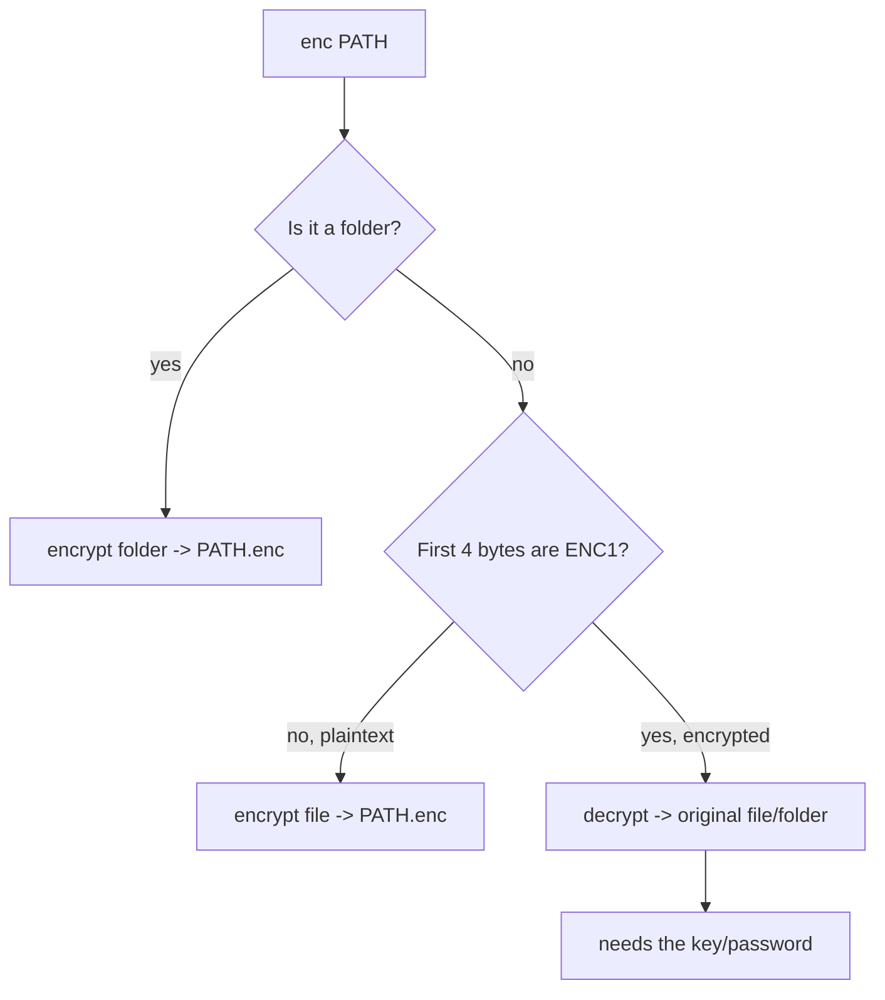
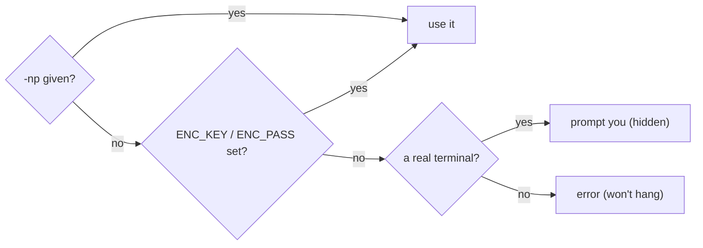
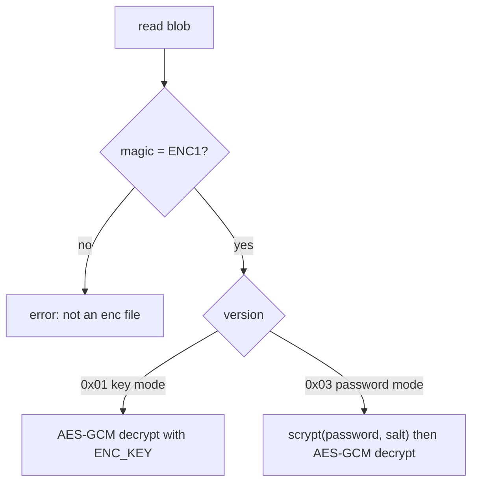

# `enc` — encrypt your files & folders

One tiny binary. AES-256-GCM. No runtime, no dependencies.

## Install

**Windows (PowerShell):**
```powershell
irm https://raw.githubusercontent.com/Xeze-org/enc/main/install.ps1 | iex
```

**Linux / macOS:**
```bash
curl -fsSL https://raw.githubusercontent.com/Xeze-org/enc/main/install.sh | bash
```

Both download the latest binary and add `enc` to your PATH. Then run `enc help`.

> Requires a published GitHub release with the binaries attached
> (`enc.exe`, `enc-linux-x86_64`, `enc-macos-arm64`, …).

---

## ⚠️ The one rule

`enc` is real encryption: **lose the key/password and the data is gone forever.**
Store it in a password manager (Bitwarden, 1Password, KeePass) — never next to
the `.enc` file.

---

## How `enc <path>` decides what to do

You don't type `encrypt` or `decrypt` — just point it at something:



It reads the file's **content**, not its name — so a rename never fools it.

---

## Quick start

```powershell
enc keygen                 # make a key — SAVE the printed value in a manager
$env:ENC_KEY = "<key>"     # load it for this terminal

enc diary.txt              # encrypt  ->  diary.txt.enc
enc diary.txt.enc          # decrypt  ->  diary.txt
enc Photos                 # encrypt a whole folder  ->  Photos.enc
```

## Command cheat sheet

| Command | What it does |
|---|---|
| `enc <path>` | Smart: encrypt if plaintext, decrypt if `.enc` |
| `enc keygen` | Make a reusable 32-byte key (prints it) |
| `enc -p [len]` | Generate a strong password |
| `enc -p [len] <path>` | Encrypt `<path>` with a generated password |
| `enc sha256 <file> [hash]` | Print a file's SHA-256, or verify it |
| `enc encrypt <path> [out]` | Explicit encrypt (file or folder) |
| `enc decrypt <file.enc> [dest]` | Explicit decrypt |
| `... -np <secret>` | Supply key/password inline (no prompt) — for scripts |

---

## Three ways to unlock

| Way | How | Best for |
|---|---|---|
| **Shared key** | set `ENC_KEY`, reuse for everything | your own quick use |
| **Per-file key** | *don't* set `ENC_KEY` → `enc` generates + prints one per file | isolating each file |
| **Password** | `enc -p [len] <path>` → generates a password | human-friendly secret |

## Where the secret comes from when decrypting



`enc` picks **key vs password automatically** from the file — you just supply
the secret.

---

## Password mode

```powershell
enc -p 30 diary.txt        # encrypt with a 30-char password (printed — save it!)
$env:ENC_PASS = "<that password>"
enc diary.txt.enc          # decrypts (auto-detects password files)
```

Uses **scrypt** + a random salt, so even a short password is hardened.

## Scripting (`-np`)

```powershell
enc secret.enc -np $secret     # no prompt, no env var; $secret = key OR password
```

> A secret on the command line can show in the process list / shell history.
> For sensitive automation, prefer `ENC_KEY` / `ENC_PASS`.

---

## ✅ Safe workflow (until you trust it)

Prove you can get data back **before** deleting the original:

```powershell
enc important                      # -> important.enc
enc important.enc  test-restore    # decrypt to a test folder
#  compare, e.g. (Git Bash):  diff -r important test-restore
#  only then delete the original
```

The `.enc` file is safe to store anywhere (cloud, USB, email) — meaningless
without the key. Just don't store the key beside it.

---

## Troubleshooting

| Message | Meaning |
|---|---|
| `key required: set ENC_KEY or pass -np` | No key available and no terminal to prompt |
| `wrong password or corrupted file` | Bad password, or the file was altered |
| `message authentication failed` | Wrong key, or the `.enc` file was altered |
| `bad magic (not an enc file)` | The input isn't an `enc` file |

**Good to know:** encrypting the same thing twice gives different bytes (random
IV — normal); a tampered `.enc` refuses to decrypt (GCM checks integrity); the
`.enc` is ~33 bytes larger than the original (+ a little for folders).

---

## Format (for the curious)

Every blob is `header | IV | ciphertext | tag`, AES-256-GCM, with the header
authenticated as GCM additional data:

```
"ENC1" (4) | version (1) | IV (12) | ciphertext (N) | tag (16)
```

Decrypt routes on the version byte:



- **v1** — default. Payload is the plaintext; key is a raw 32 bytes.
- **v2** — legacy (embedded SHA-256). No longer written; still readable. It added
  nothing over GCM's own auth tag, so it was dropped. For a real fingerprint use
  `enc sha256`.
- **v3** — password mode. Layout inserts a 16-byte `salt` right after the version;
  the key is `scrypt(password, salt)` (`log_n=15, r=8, p=1`).

**Folders:** packed into a `tar` archive (symlinks preserved), then encrypted.
`enc decrypt` auto-detects a folder blob by sniffing the `tar` magic in the
decrypted bytes.

---

## Build

```bash
cargo build --release      # -> target/release/enc(.exe)
```

Pure Rust, no system dependencies. Crates: `aes-gcm`, `scrypt`, `sha2`, `tar`,
`hex`, `getrandom`.
