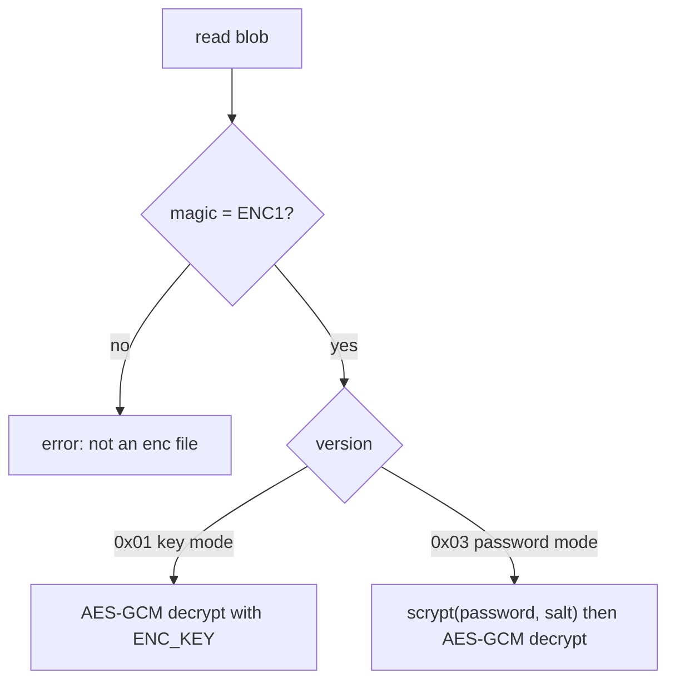

# File format

[← back to README](../README.md)

The on-disk `.enc` format used by `enc`. There is one implementation (the Rust
binary); this is documented so it stays simple and re-implementable.

## Layout

Every blob is `header | IV | ciphertext | tag`, AES-256-GCM, with the header
authenticated as GCM additional data (AAD):

```
"ENC1" (4) | version (1) | IV (12) | ciphertext (N) | tag (16)
```

- **Cipher:** AES-256-GCM · **IV:** 12 random bytes per message · **Tag:** 16 bytes
- The tag is appended last (how most AES-GCM APIs return `ciphertext || tag`).

## Version dispatch on decrypt



- **v1** — default. Payload is the plaintext; key is a raw 32 bytes.
- **v2** — legacy (embedded SHA-256). No longer written; still readable. It added
  nothing over GCM's own auth tag, so it was dropped. For a real out-of-band
  fingerprint use `enc sha256`.
- **v3** — password mode. Layout inserts a 16-byte `salt` right after the version;
  the key is `scrypt(password, salt)` (`log_n=15, r=8, p=1`).

## Folders

Packed into a `tar` archive (symlinks preserved), then encrypted with the format
above. `enc decrypt` auto-detects a folder blob by sniffing the `tar` magic in
the decrypted bytes, so `-dir` is rarely needed explicitly.

## Build

```bash
cargo build --release      # -> target/release/enc(.exe)
```

Pure Rust, no system dependencies. Crates: `aes-gcm`, `scrypt`, `sha2`, `tar`,
`hex`, `getrandom`.

**You don't need Rust to *run* `enc`** — released binaries are self-contained
native programs (Rust is only used to build them, once, in CI). Linux binaries
are built **static (musl)**, so they run on any distro — Alpine, Ubuntu, or a
`scratch` container — with no glibc required.
